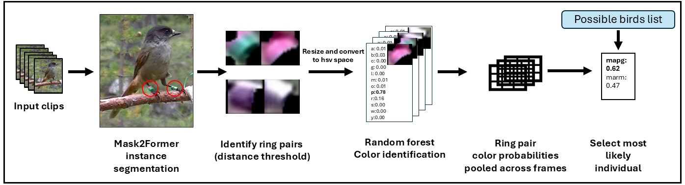

# CORVID Pipeline Tutorial



**CORVID** (Colour Ring Video Identification) is a pipeline for identifying individual birds from video footage by detecting and classifying their colour rings.

---

## Pipeline Overview

```
Video
[Annotations] Sample frames from your videos
[Annotations] Manually annotate bird bounding boxes and ring segmentation masks
  │
  ▼
[Stage 1 — Training] Train ring instance segmentation model (MMDetection)
[Stage 2 — Training] Train colour classifier (Random Forest on HSV features)
[Stage 3 — Training] Train bird detector (YOLOv8)
  │
  ▼
[Stage 4 — Inference]
  Video → YOLO detection → tracked bounding boxes
       → MMDetection ring segmentation → ring contours
       → Random Forest → colour probability vectors
       → CORVID matching algorithm → {track_id: bird_id}
```

The matching algorithm aggregates ring colour predictions over an entire tracklet (all frames where a bird is tracked), builds a ring-pair probability matrix, and scores each candidate bird identity. Conflict resolution ensures co-visible birds are not assigned the same identity.

---

## Requirements


```bash
pip install torch torchvision
pip install openmim
mim install mmengine mmcv mmdet

pip install ultralytics
pip install scikit-learn opencv-python tqdm pandas matplotlib pyyaml
```

> **GPU:** All stages require a CUDA GPU. Ring segmentation training and inference are the most memory-intensive steps. Mask2Former (the one used in manuscript) needs ~14 GB VRAM; MaskRCNN runs on 6–8 GB.

---

## 1. Annotation

Before any training stage, raw images/video frames need to be annotated to produce the COCO-format JSON files used throughout this tutorial (ring segmentation masks, colour ring categories, bird bounding boxes).


### Sampling Frames from Video

Before annotating, you need a set of representative still frames extracted from your videos. Use `tools/SampleRandomFrames.py` to randomly sample frames from a video:

```bash
python tools/SampleRandomFrames.py \
    --Input  /path/to/video.mp4 \
    --Output /path/to/frames_dir \
    --Frames 500
```

This saves `--Frames` randomly chosen frames as `{video_basename}_F{frame_number}.jpg` in `--Output`. Run it once per video, sampling into the same output directory to build up a pooled set of frames to annotate (see Section 1 for how many images you'll likely need).

### Labelling in label studio
We use [Label Studio](https://labelstud.io/) for annotation. See the [Label Studio annotation guide](https://alexhang212.github.io/YOLO_Behaviour_Repo/annotation.html) from my previous publication for step-by-step setup and export instructions. However, the setup will be slightly different, because we need both bounding box of the bird and masks of the rings. When starting a new project in label studio, click "Custom template". and in the labelling interface, click "code". Then paste this below as template, and you can the start labelling bird bounding boxes + ring masks.


```
<View>

<View style="display:flex;align-items:start;gap:8px;flex-direction:column"><Image name="image" value="$img" zoom="true" zoomControl="true"/>

 <RectangleLabels name="label" toName="image" showInline="true">
  <Label value="bird" background="#001eff"/></RectangleLabels></View>

<PolygonLabels name="mask" toName="image" strokeWidth="3" pointSize="small" opacity="0.9">

<Label value="R" background="#FFA39E"/><Label value="G" background="#D3F261"/><Label value="B" background="#0d12a0"/><Label value="Y" background="#dbca5c"/></PolygonLabels>

</View>
```
After pasting this, you will need to change the segmentation classes to the colours you have!

The amount of images required depends on the image quality, I would say ~500 images to start, build up to ~1000 and beyond.

### Converting label studio to coco data
After labelling on label studio, you will need to convert it to coco format for the rest of the pipeline. Export your project from Label Studio as **JSON-MIN**, then run `tools/label_studio_to_coco.py`:

```bash
python tools/label_studio_to_coco.py \
    --ls_json  /path/to/label_studio_export.json \
    --out_coco /data/annotations/all.json
```

This writes a **single combined** COCO file containing both bird bounding boxes (category `"bird"`) and ring polygon masks (category = colour letter). Add `--val_ratio 0.1` to split by image into `all_train.json`/`all_val.json` directly. Copy/symlink your images next to the output JSON(s), since every training script resolves `file_name` relative to the COCO JSON's own directory (see Section 2 below).

Since this one file mixes both annotation types, Stage 1 and Stage 3 each take a `--categories` filter to pick out only the classes they care about (see Sections 3 and 5) — a category not requested is simply ignored, so the same combined file can be passed to every stage.

---

## 2. Data Preparation

All three training stages take COCO-format JSON files directly — there's no
separate image-directory argument. Each JSON's `images[].file_name` paths are
resolved **relative to the directory containing that JSON file**, so a
dataset can be shared/moved as a single self-contained folder (json + images
together). Train and val/test splits can even live in different folders,
since each JSON resolves independently.

If you used `tools/label_studio_to_coco.py` (Section 1), you'll have one
combined COCO file with both bird bboxes and ring polygon masks — that's
fine, pass it as-is to `--coco_train`/`--coco_val` in every stage and use
`--categories` (Stage 1, Stage 3) or `--colours_json` (Stage 2) to select
the relevant classes out of it. The per-datatype formats below are only
needed if you're assembling COCO files by hand or from another source.


### 2a. Ring Segmentation Data

You need COCO-format JSON files with **polygon instance masks** for each ring.

**Minimum required format:**

You can use a single `"ring"` class (recommended for simplicity) or use the 12 CHIRP colour classes (`A`, `B`, `C`, `G`, `L`, `M`, `O`, `P`, `R`, `S`, `W`, `Y`) as category names. The Random Forest handles colour classification regardless of how many classes the segmentation model uses — but if you want to feed the **same** COCO files into Stage 2 (colour classifier), use the 12 colour categories.

The **CHIRP RingMask dataset** (`SegBox/RingMask`) provides 944 labelled images ready to use.

### 2b. Colour Classifier Data

The RF classifier now reads directly from COCO-format JSON files with
**polygon instance masks**, exactly like 1a — the same annotation files can
be reused as long as each annotation's `category_id` maps to a single-character
colour code (e.g. `"R"` for red, `"Y"` for yellow) rather than a generic `"ring"` class.

You also need a small JSON listing the valid colour classes, in the order you
want them reported (e.g. `Classes.p` output order):

```json
["A", "B", "C", "G", "L", "M", "O", "P", "R", "S", "W", "Y"]
```

Any annotation whose category name isn't in this list (e.g. a generic `"ring"`
category from a segmentation-only dataset) is skipped when loading colour
classifier data.

Each ring polygon is perspective-warped into a 20×20 crop internally (see
`crop_ring_from_polygon()` in `2_train_colour_classifier.py`).

### 2c. Bird Detection Data

COCO-format JSON files with **bounding boxes** (no masks needed) for whole birds.


The **CHIRP BirdBoxMask dataset** provides 1,762 labelled images.

### 2d. Possible Bird IDs

A CSV listing candidate bird IDs per video:
```csv
Video,PossibleBirds
20210909_OiFHBq_1,"['ABLM', 'RRYY', 'WGYB', 'GRBL']"
20210909_CFfo1Z,"['ABLM', 'WGYB', 'YYRR']"
```

Or a plain `.txt` file with one 4-character ID per line (applied to all videos):
```
ABLM
RRYY
WGYB
```

Bird IDs are **4-character strings** where each pair of characters represents one ring (e.g. `RRYY` = Red-Red on one leg, Yellow-Yellow on the other).

---

## 3. Stage 1 — Train Ring Segmentation Model

```bash
python 1_train_ring_segmentation.py \
    --coco_train  /data/ring_annotations/train_rings.json \
    --coco_val    /data/ring_annotations/val_rings.json \
    --save_dir    /weights/Segmentation \
    --model_type  maskrcnn50 \
    --epochs      50 \
    --batch       2
```

Images referenced in `train_rings.json`/`val_rings.json` are resolved relative
to `/data/ring_annotations/` (i.e. `file_name` is a path relative to the JSON's
own directory).

### Preprocessing: cropping to the bird box

At inference (see `mmdet_mask_inference()` in `4_run_inference.py`), this model runs on a **crop of just the tracked bird**, not the full video frame. To avoid a train/inference mismatch, this script automatically does the same thing to your training data:

- If `--coco_train`/`--coco_val` contain bird bounding boxes (category name given by `--bird_category`, default `"bird"`) alongside ring polygon masks — e.g. the combined output of `tools/label_studio_to_coco.py` — each bird instance is cropped out of its source image, keeping only the ring masks whose centroid falls inside that bird's box (remapped to crop-local coordinates). A ring inside more than one overlapping bird box goes to the smallest/tightest one; rings inside no box are dropped, with a count printed.
- Cropped images and the remapped COCO file are cached under `{save_dir}/ring_crops_train` and `{save_dir}/ring_crops_val`, and training runs on those.
- If your COCO file has no `--bird_category` category at all (e.g. an already-cropped, ring-only dataset like CHIRP RingMask), it's used as-is — no cropping step.

```bash
python 1_train_ring_segmentation.py \
    --coco_train  /data/annotations/all_train.json \
    --coco_val    /data/annotations/all_val.json \
    --categories  "R,G,B,Y" \
    --save_dir    /weights/Segmentation \
    --model_type  maskrcnn50 \
    --epochs      50 \
    --batch       2
```

`--categories` restricts training to the given ring/colour classes — it also controls which ring masks are kept during the crop step above. Any other category present (e.g. `"bird"` itself) is ignored.

### Model options

| `--model_type`      | VRAM   | Notes                                   |
|---------------------|--------|-----------------------------------------|
| `maskrcnn50`        | ~6 GB  | Good baseline, fastest to train         |
| `maskrcnn101`       | ~8 GB  | Slightly better accuracy                |
| `cascade_maskrcnn50`| ~8 GB  | Higher accuracy than MaskRCNN           |
| `mask2former`       | ~14 GB | Best accuracy; used in published CORVID |

### Outputs

```
/weights/Segmentation/
├── ring_crops_train/         # cached bird crops + remapped COCO (if cropping ran)
├── ring_crops_val/           # same, for the validation split
├── best_coco_segm_mAP.pth    # best checkpoint (by segm mAP)
├── last_checkpoint           # symlink to latest epoch
└── {timestamp}.log           # training log
```

Copy your config and checkpoint files into `weights_dir/Segmentation/` (see Section 6) — no renaming needed, `4_run_inference.py` auto-detects whichever single `.py`/`.pth` pair is in that folder.

---

## 4. Stage 2 — Train Colour Classifier

```bash
python 2_train_colour_classifier.py \
    --coco_train   /data/ring_annotations/train_rings.json \
    --coco_val     /data/ring_annotations/val_rings.json \
    --colours_json /data/ring_annotations/colours.json \
    --output_dir   /weights/CORVID
```

Add `--tune` to run `RandomizedSearchCV` hyperparameter search (~50× slower but may improve accuracy by a few percent):

```bash
python 2_train_colour_classifier.py \
    --coco_train   /data/ring_annotations/train_rings.json \
    --coco_val     /data/ring_annotations/val_rings.json \
    --colours_json /data/ring_annotations/colours.json \
    --output_dir   /weights/CORVID \
    --tune
```

This works directly on the combined output of `tools/label_studio_to_coco.py` too — no `--categories` flag needed here, since `--colours_json` already restricts which annotations are read (bird bboxes are simply not colour names and get skipped). Unlike Stage 1, there's no separate crop-to-bird step needed: each ring polygon is cropped straight out of the full-frame image using its own absolute coordinates, regardless of whether a bird box exists.

### Preprocessing

For every ring polygon annotation:
1. **Crop** — the polygon is masked out of the source image and perspective-warped to a fixed 20×20 pixel crop (`crop_ring_from_polygon()`), the same geometry `run_rf()` in `4_run_inference.py` uses at inference time.
2. **Feature extraction** — each 20×20 crop is converted to HSV and three 10-bin histograms (H, S, V) are concatenated into a 30-dimensional feature vector (`extract_hsv_features()`).
3. **Standardize** — a `StandardScaler` is fit across all train+test features (zero mean, unit variance per feature) before the Random Forest sees them.

A `RandomForestRegressor` is trained on the standardized features and outputs a soft probability vector over all colour classes, which the CORVID matching algorithm uses to score candidate identities.

### Outputs

```
/weights/CORVID/
├── RandomForestModel.p       # trained RF model
├── TrainImagesFeatures.p     # raw train features (needed at inference for StandardScaler)
├── Classes.p                 # ['A', 'B', 'C', ...]
├── ConfusionMatrix_RF.png
└── Accuracy.csv
```

**Why `TrainImagesFeatures.p`?** At inference, the StandardScaler is re-fit on the training features combined with each test sample — this is the normalisation strategy used in the original CORVID paper. The file must be present in `weights_dir/CORVID/`.

`Classes.p` is technically optional at inference — if it's missing, `4_run_inference.py` assumes the standard 12 CHIRP colour classes (`A,B,C,G,L,M,O,P,R,S,W,Y`) — but keep it alongside the other two files unless you're certain your colour set matches that default exactly.

---

## 5. Stage 3 — Train Bird Detector

```bash
python 3_train_yolo.py \
    --coco_train  /data/bird_annotations/train_birds.json \
    --coco_val    /data/bird_annotations/val_birds.json \
    --output_dir  /data/yolo_dataset \
    --save_dir    /weights/Detection \
    --model       yolov8n.pt \
    --epochs      100
```

The script converts COCO annotations to YOLO format, writes a `dataset.yaml`, and trains via ultralytics. Images are resolved relative to each COCO JSON's own directory.

If your COCO file also contains ring polygon masks (e.g. the combined output
of `tools/label_studio_to_coco.py`), add `--categories "bird"` so only bird
boxes are converted to YOLO labels:

```bash
python 3_train_yolo.py \
    --coco_train  /data/annotations/all_train.json \
    --coco_val    /data/annotations/all_val.json \
    --categories  "bird" \
    --output_dir  /data/yolo_dataset \
    --save_dir    /weights/Detection \
    --model       yolov8n.pt \
    --epochs      100
```

### Model size guide

| `--model`   | Speed   | Accuracy |
|-------------|---------|----------|
| `yolov8n.pt`| Fastest | Lower    |
| `yolov8s.pt`| Fast    | Medium   |
| `yolov8m.pt`| Medium  | Higher   |
| `yolov8l.pt`| Slower  | Best     |

Start with `yolov8n.pt` and upgrade if detection recall is insufficient.

### Outputs

```
/weights/Detection/
└── bird_detection/
    └── weights/
        ├── best.pt
        └── last.pt
```

Copy the best weights into `weights_dir/YOLO/` (see Section 6) — any filename works, `4_run_inference.py` auto-detects whichever single `.pt` file is in that folder:
```bash
cp /weights/Detection/bird_detection/weights/best.pt /weights/YOLO/
```

---

## 6. Weights Directory Layout

Before running inference, organise your trained weights as follows. This matches the layout of the provided CHIRP pretrained weights release, so you can point `--weights_dir` straight at it without renaming anything:

```
weights/
├── YOLO/
│   └── *.pt                       # bird detector, from stage 3 — any filename (e.g. Bird_YOLOv8.pt)
├── Segmentation/
│   ├── *.py                       # mmdet config, from stage 1 — any filename
│   └── *.pth                      # mmdet weights, from stage 1 — any filename
└── CORVID/
    ├── RandomForestModel.p        # from stage 2
    ├── TrainImagesFeatures.p      # from stage 2
    └── Classes.p                  # from stage 2 (optional — see note in Section 4)
```

`4_run_inference.py` auto-detects the single `.pt` file under `YOLO/` and the single `.py`/`.pth` pair under `Segmentation/` — it errors out if a folder has zero or more than one matching file, so keep old checkpoints elsewhere.

---

## 7. Stage 4 — Run Inference

```bash
python 4_run_inference.py \
    --video_dir    /data/videos \
    --output_dir   /results \
    --weights_dir  /weights \
    --possible_ids /data/possible_birds.csv
```

`--weights_dir` can point directly at the provided CHIRP pretrained weights release (e.g. `.../CHIRP_Dataset/Weights`) since it already matches the layout in Section 6 — no need to reorganise or rename anything.

### Optional arguments

| Argument          | Default | Description                                          |
|-------------------|---------|------------------------------------------------------|
| `--mask_thresh`   | `0.5`   | Ring segmentation confidence threshold               |
| `--yolo_thresh`   | `0.5`   | Bird detection confidence threshold                  |
| `--iou_thresh`    | `0.4`   | IoU threshold for cross-frame tracking               |

### Output format

For each video `{name}.mp4`, the script writes five files to `--output_dir`:

```
/results/{name}_BBoxes.csv           frame,track_id,x1,y1,x2,y2
/results/{name}_Segmentations.csv    frame,track_id,ring_id,contour
/results/{name}_CORVID_IDMatch.p     {track_id: bird_id_or_"unringed"}   (pickle)
/results/{name}_CORVID_IDMatch.csv   track_id,bird_id                   (same mapping as the pickle)
/results/{name}_BBoxes_WithID.csv    frame,track_id,x1,y1,x2,y2,bird_id
```

**`{name}_BBoxes.csv`** — every tracked bird bounding box from YOLO detection + IoU tracking, one row per frame per track:
```csv
frame,track_id,x1,y1,x2,y2
0,0,10.0,20.0,100.0,120.0
0,1,200.0,20.0,300.0,120.0
```

**`{name}_Segmentations.csv`** — every detected ring polygon per tracked bird box. `contour` is a `[[x,y],[x,y],...]` string (`ast.literal_eval`-readable), and `ring_id` is the segmentation model's own label (colour + instance count, e.g. `"R-0"`):
```csv
frame,track_id,ring_id,contour
0,0,R-0,"[[15, 25], [20, 25], [20, 30], [15, 30]]"
```

**`{name}_CORVID_IDMatch.p`** / **`.csv`** — the final `{track_id: bird_id}` mapping from the CORVID matching algorithm, as pickle and CSV respectively:
```python
{track_id: "RRYY"}     # matched bird ID
{track_id: "unringed"} # no confident match
```
The pickle is compatible with `ApplicationSpecific/ComputeMetrics.py` when using the `CORVID` algorithm. If only the pickle exists from a previous run (e.g. from before the CSV output was added), re-running the script fills in the missing `IDMatch.csv` without reprocessing the video — the other CSVs need a full reprocess, since they come from per-frame data not saved in the pickle.

**`{name}_BBoxes_WithID.csv`** — the one file most users want: every tracked bounding box joined with its final bird ID, ready to use directly without touching the pickle:
```csv
frame,track_id,x1,y1,x2,y2,bird_id
0,0,10.0,20.0,100.0,120.0,RRYY
0,1,200.0,20.0,300.0,120.0,unringed
```

---
