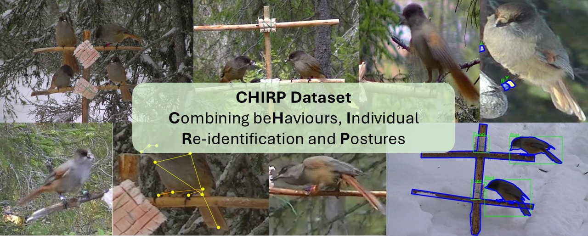

# [CVPR 2026] CHIRP dataset: towards long-term, individual-level, behavioral monitoring of bird populations in the wild

<!-- banner -->

Alex Hoi Hang Chan, Neha Singhal, Onur Kocahan, Andrea Meltzer, Saverio Lubrano, Miya Warrington, Michael Griesser*, Fumihiro Kano*, Hemal Naik*

## Dataset Download
Here is the download [link]() for the dataset.

## What is CHIRP?
CHIRP is a dataset on Siberian Jays (*Perisoreus infaustus*) living in the Swedish Laplands. We the goal of long-tem individual level behavioural monitoring, we provide dataset for a diverse set of computer vision tasks:
- [Video re-identification](docs/VideoReID.md) (182 individuals, 16,110 video clips)
- [Action Recognition](docs/ActionRecognition.md) (3 behaviours, 1,387 video clips)
- [2D keypoint estimation](docs/Keypoints2D.md) (13 keypoints, 1,178 instances)
- [Bird segmentation, bounding box](docs/SegBox.md) (1,669 instances)
- [Colour ring segmentation](docs/SegBox.md) (12 colours, 944 images)

[**Application specific benchmark**](ApplicationSpecific/README.md): a novel benchmarking procedure by combining tasks to evaluate on biologially relevant metrics

Click the links above to access detailed description of each dataset!

## Application Specific Benchmark
**We highly encourage researchers to report this in addition to task-specific benchmarks!**

One contribution of the CHIRP datasets is that on top of task-specific benchmarking (e.g 2D keypoints estimation, object detection, re-id accuracies etc), we encourage researchers to apply new algorithms in our application specific dataset, to determine how improvements in the algorithms will affect downstream biological measurements like feed rates and co-occurence rates.

For details of how to do the benchmarking procedure and data requirements, we refer to **[ApplicationSpecific/README.md](ApplicationSpecific/README.md)** 

## Contact
If you have any questions regarding the dataset, feel free to reach out to Alex Chan!

hoi-hang.chan[at]uni-konstanz.de

## Acknowledgements
This work is funded by the Deutsche Forschungsgemeinschaft (DFG, German Research Foundation) under Germany’s Excellence Strategy—EXC 2117—422037984, DFG project 15990824, DFG Heisenberg Grant no. GR 4650/21 and DFG project Grant no. FP589/20. MHW is supported by an Oxford
Brookes University Emerging Leaders Research Fellowship. We thank Francesca Frisoni and Jyotsna Bellary for doing additional annotations for the application specific benchmark. We thank all the researchers and field workers who worked in the Luondua Boreal Field Station over the years for their contributions to the long-term dataset.